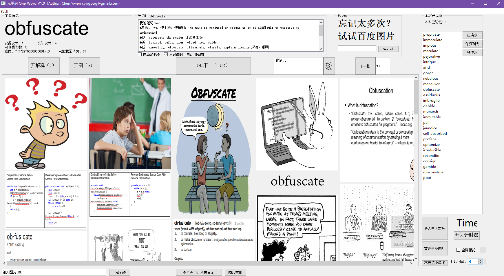
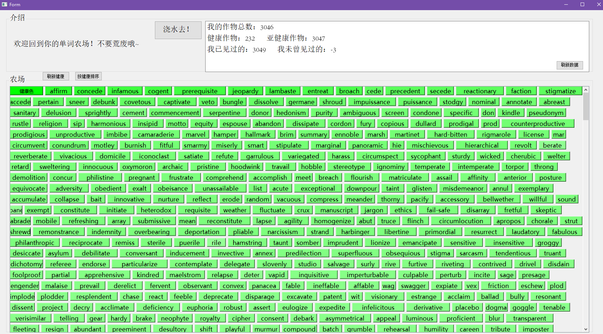

# Introduction and Usage

This is a tool to help you memorize English words, like GRE words.

It uses pictures from the Google to help you memorize those words visually. It is a game designed software, you can image each of those words is a crop. If you don't water it, it will dies soon and the words will fade from your brain.

So you have to memorize words everyday. The way to water your crops, is to click those pictures which can help in your memorize.

For example,

If you want to memorize this word, just click those related pictures. After you clicked, it means you have watered your crop. 
THen the crop becomes greener in your farm. The greener the crop is, the better the quality of your memorization of this word.

# 介绍（中文）
这是一个可帮助您记住GRE单词等英语单词的工具。

它使用Google提供的图片来帮助您直观地记住这些单词。 这是一个游戏设计的软件，您可以将这些单词中的每一个图像想象成庄稼。 如果不给它浇水，它很快就会死掉，单词也会从大脑中消失。

因此，您必须每天记住单词。 给农作物浇水的方法是单击那些有助于记忆的图片。

例如，

如果您想记住这个词，只需单击那些相关图片。 单击后，表示您已经给作物浇水了。
这样，您的农场中的农作物就会变绿。 作物越绿，背单词的质量越好。

# Dataset
I will not upload those dataset of pictures about 30GB. Those pictures are auto collected from google image. If you need, email me or leave your email in the Issues.
